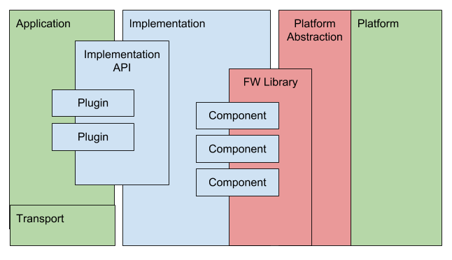
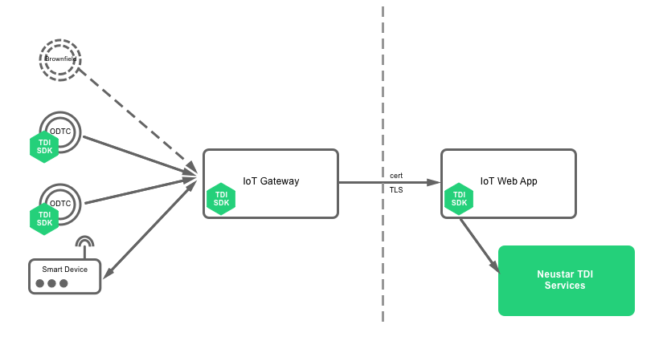

[](https://circleci.com/gh/Neustar-TDI/ntdi-sdk-java)


## Prerequisite Information

Before you continue with this SDK, STOP what you are doing and review the [TDI Overview](./TDI_overview/TDI_OVERVIEW.md) and [TDI Whitepaper](./TDI_overview/assets/TDI-WhitePaper.pdf) to fully understand the value proposition and core techinical concepts.

===================

Now that you understand how powerful the TDI concepts are as compared to alternatives and how difficult and time consuming implementing cryptographic operations can be, lets now make your life easier by introducing the TDI SDK!!

## Overview

If you read the TDI Overview, one of the main problems with security today is that security can be expensive to implement throughout a device life-cycle.

The primary purpose of this SDK is to reduce the time, cost and risk associated with developing complex cryptographic workflows as it relates to application messaging and identity and to reduce cost and complexity of software development for ecosystem partners by facilitating re-use via portable and extensible components and clean abstractions,improving interoperability and minimizing API fragmentation across a heterogeneous IoT implementation.

## TDI Java SDK Component Layout and Definitions



**"FW_library (Framework)"** Is the core **Framework**. It is the glue layer and dependency injection framework for all the repositories. It contains base classes, interfaces, and plugin/platform binding logic.

It's "Library" Class is meant to be instantiated by an "Implementation" of which we provide one that is used in our examples included in this repository. It is not meant to contain any code relating to particular encodings or workflows.

It merely provides interfaces and classes that platforms, implementations and plugins will use to be independent of one another. Configuration options are also malleable by defining data requirements at instantiation to be loaded by higher or lower level libraries.

**"Platform and "Platform Abstraction"** are largely the roles of what the current TDI SDK encompasses.

We provide an example platform implementation included in this repository that is meant to abstract away the lower layer specific (data storage, crypto, clock, etc) aspects away from the higher level code constructs.

The idea is that ANY platform written should work with ANY implementation and all the higher level code written on top of an implementation (ie: plugins, apis, etc). A platform must strictly implement the platform (and facet) interfaces in order to be interoperable. Facets were added relatively recently to break the logic apart, and allow replacing a single aspect of the platform while leaving the rest alone. More work is needed to make this simpler to do.

**"Implementation"** is the primary high-level interoperability target, and is versioned.  Our examples demonstrate the use of the TDI SDK with "compatible" implementations for Device/Fleet Server/API Server.

It provides a top level API and contains an instantiation of the framework. This provides a higher level API to end users, and optionally defines "flows" behind these API methods to make them extensible.

**"Components"** are reusable pieces of code in an implementation for reasons of code-reuse and simplification.

**"Application"** is the user-level aspects that use the "implementation".

**"Plugins"** are Application-level optional modules that enable features and modify implementation control flow.  This allows us to release commercial plugins that expand on features of a base implementation.

This folder contains a set of API Plugin class instances that are specific to our initial TDI flows. These are portable as long as the flows in the implementation sdk folder remain constant. They extend the default API provided by the initial implementation sdk when injected in the implementation instantiation. They also can define optional or required configuration options. For now, we relegate all higher-level non-device specific functionality to plugins to keep things composable and simple.

Our examples use our initial sample implementation sdk, and is not meant to be treated as a module or dependency. This also contains some tools for handling key materials, which should most likely be moved to our initial implementation in some way.

### TDI Productized "Implementation" Features

* Messaging System
* Self Describe Message Handling and Generation
* Nonce Version (Or simply "implementation version")
* Pluggable Serialization Type
* Pluggable Algorithm Type
* Fleet(s) accepted
* Flags
* Fleet hierarchy support
* Storage Limits
* Nonce Storage semantics
* Key data structure scoping (Fleet / Role / Kid to enable multiple fleets)
* Onboarding (Original Provision at MFG or implementor on brownfield hardware)
* Ownership Transfer (Change device public fleet keys)
* Fleet Hierarchy Scoping (Give permissions to another fleet to deal with a device by setting it as a child)
* Delegation (Broker all messages through original owning fleet)
* Bootstrap (Credential and config to be used to phone home to request ownership transfer)
* Reset (Use reset keys to change fleet public keys)
* Basic Policy management and Hooks
* Choosable "out-of-scope" auth (Oauth, Auth0, SSO, etc)
* Plugin Architecture
* Pre-defined implementation points for commercial or open source plugins:
* New methods in implementation
* Hook points in base implementation promise chains:
-Sign
-pre-validate
-Pre-pack
-pre-key
-pre-sign
-post-sign
* Validate:
-Pre-parse
-pre-validate
-pre-auth
-pre-return

### Example Implementation

Diagram showing components of TDI in a real world scenario:




## Developer Information

This is Neustar's Trusted Device Identity (TDI) implementation in Java 8.

[Framework](./framework) is pulled in by these other components in the course of their installation. Application code _may_ use definitions from this namespace, but should not otherwise know of it. All application usage of TDI should be done via the [sdk package](./sdk). See that documentation for the TDI API.


### Build:
```bash
mvn clean package
```

### Documentation:
```bash
mvn javadoc:javadoc
```

### Adding NTDI SDK as a dependency to other projects
```XML
<dependency>
    <groupId>biz.neustar.tdi</groupId>
    <artifactId>framework</artifactId>
    <version>1.0</version>
</dependency>
```

### Logging:
This project uses slf4j API for logging. So please drop an implementation of logger compatible with slf4j API in `CLASSPATH` of your application (where this project is being used) if you want logging.
