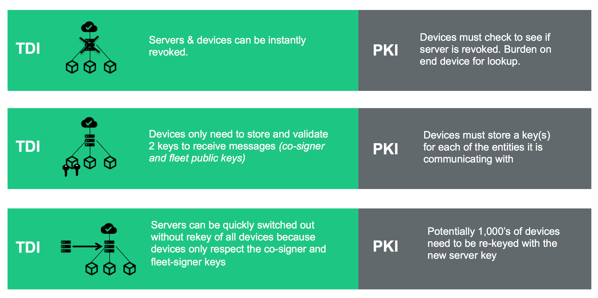
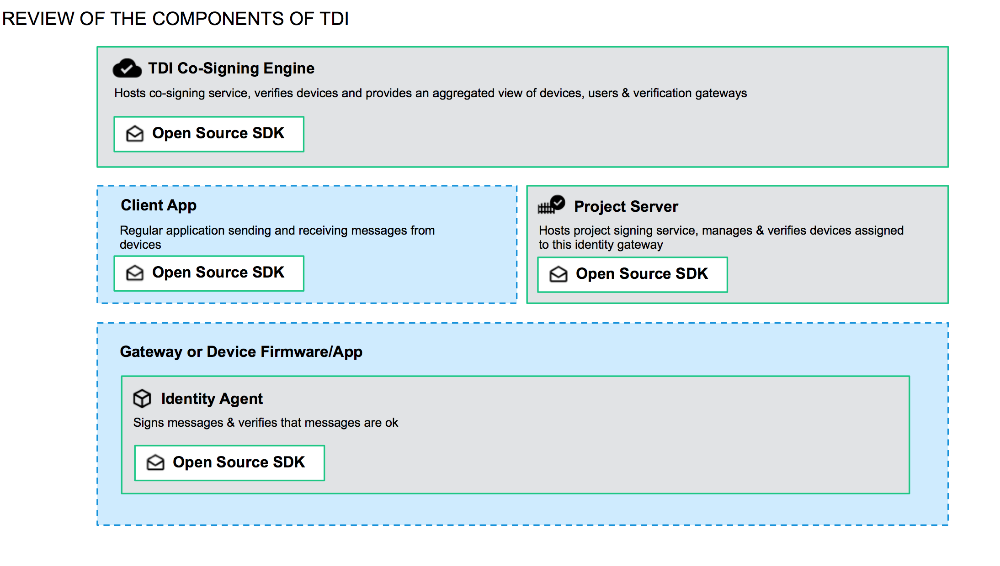
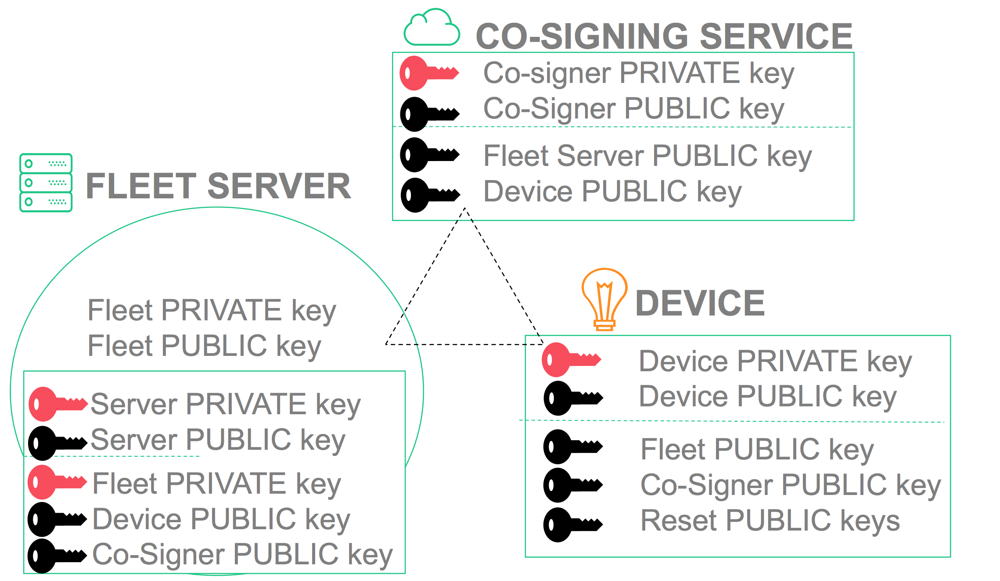
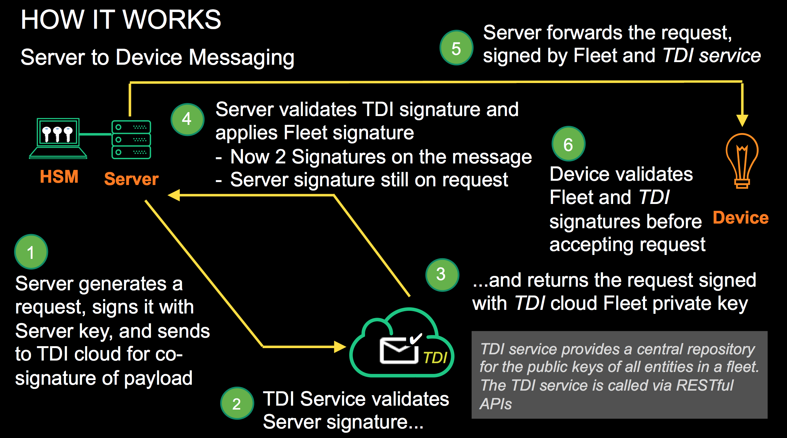
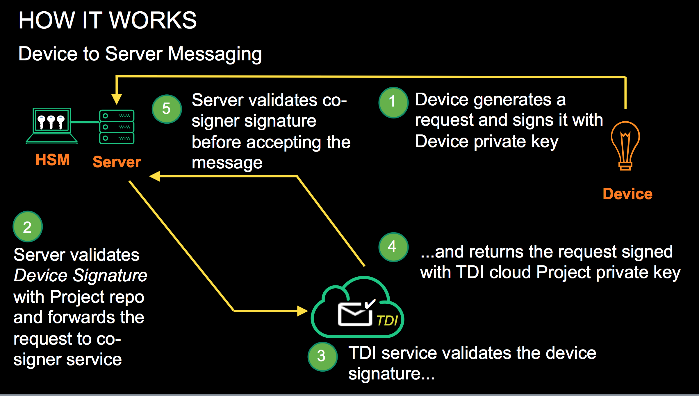

## Table of Contents

## Core Problems

Security is top of the agenda for anyone involved in the IoT industry. However, it is a difficult and potentially costly area to get right. With billions of connected devices and ever-greater complexity comes an increased threat of attack and the need to secure the data and infrastructure of the 'things' at multiple levels.

The challenges facing the industry are as follows:

1. Security can be expensive to implement throughout a device life-cycle

2. Secure devices are difficult to manage at scale

3. The industry lacks confidence in the data being passed to and from sensors and actuators, and are
therefore unable to realize the full economic benefits of the IoT

## Solutions Needed

1. There needs to  shift the economics of security

Security should be affordable throughout the device life cycle.

2. Making security practical at scale

IoT cloud operators need the facility to manage the identities of a vast numbers of devices, securely and efficiently,
regardless of the different device types or silicon inside them.

3. Security across the entire value chain

A key benefit of the IoT lies in the data generated and exchanged, and the analysis and information
extracted from this data. Companies must be able to determine the reliability of the data and the identity associated with it, to make the
shared financial benefits of the ecosystem a reality.

## Problems with existing solution (PKI)

Right now the only solution folks are choosing is either no solution or a rough username/password/API key solution or to implement a PKI solution.

PKI is not providing enough impact to solving the current challenges of the IoT outlined above.

Traditional PKI-based identity management solutions are leaving IoT enterprises exposed and overburdened with the need for certificate management of thousands of devices.

Using X.509 certificates to provide secure communications for IoT systems creates two big problems:

### Certificate Management

X.509 Certificates have a time-to-live (TTL), which requires that certificates be renewed and updated before they expire. This means that the certificates must be monitored and managed, and due to the sheer number of IoT devices that a system may be responsible for, there are issues of scalability in keeping track of all device's certificates and renewing them before they expire.

### Checking Revoked Certificates

Using a PKI-based identity management solution, you must check if certificates have been revoked, either by using a CRL (Certificate Revocation List) or an OCSP service (Online Certificate Status Protocol). The more commonly used CRL requires downloading a list of revoked certificates, which, due to resource constraints, are not typically updated frequently throughout the day. A device's certificate could have been revoked and another device's certificate may not know it because its most recent CRL was updated before that revocation. There is risk that devices with revoked certificates may not be caught, and their messages could be considered valid.

## Overview of TDI Solution

TDI solves alot of the scaling and

### What is Neustar Trusted Device Identity (TDI)?
Neustar Trusted Device Identity (TDI) offers a fresh take on traditional PKI; built from the ground up to address the unique security challenges of scale and resilience required to secure and manage large IoT deployments to provide the solutions outlines above.

### How is TDI used?
Neustar TDI is used to grant a strong identity to each IoT element, securely pass messages to other elements, and take action based on flexible, robust and easily-managed policies.

The foundational innovations are two fold; firstly, device messages are **authenticated in real time**, which means that fraudulent communications are immediately detected and invalidated. Secondly, our **multi-factor identity abstraction** ensures that devices do not need to know the identity of a message source, only that they can trust the message they are receiving.

### Why choose TDI?
When it comes to IoT security, it is not a question of _if_ the system will be breached but _when_. TDI offers a [Revocation](#revocation) solution as a more scalable approach to IoT security and recovery from security breaches.

Simple Summary of TDI over PKI

## Glossary of TDI Terms

#### API Key
>Anything that has identity, there may be policy associated with the identity (can ask for co-signer etc). Can be a device, an app etc.

#### Co-Signer Service
>Signs with the Identity core key & validates messages & identity of identity node server

#### Client App
>Application running on a device or a server

#### Device
>Anything placed at the edge of the network - this can be anything from a gateway, mobile phone or thermostat

#### Entity
>Generic name for device, app or human

#### Entity Policy
>Describes level of access users have in the system and the level of access one device has to act upon another.
There are 3 entities as far as policy goes:
>
* An app
* The human
* The device

> ##### User Policy
  1. Primary Owner - (usually the person who created the account) has the ability to delete the team. God!
  2. Owner — Owners control the highest-level security and administrative settings: payments and billing, team authentication, message and file retention, and so on.
  3. Admin — Administrators are able to manage members, manage nodes, and handle maintenance functions. May have several Administrators.
  4. Member — Have access to standard features, but no edit

#### Fleet
>Group of devices and/or servers - fleets are assigned to nodes for co-signing. THEY ARE GROUPS.

#### Gateway
>Potentially headless device that acts a a bridge between edge devices and the cloud. Could be a mobile device (IOS / Andriod).

#### Server
>A computer or device on a network that manages network resources. For example: File server, Print Server, Database server, Application Server

#### Signer Service
>Signs with the identity node key & validates messages & identity of identity core server

## TDI System Elements

At the core of a TDI deployment are devices and associated services, each with their own private signing key and public verification key. These are broken out into four key elements:

### Fleet
A Fleet defines the scope of the deployment. Typically, a Fleet is comprised of devices with a
certain SKU and those devices’ supporting services. The defining characteristic of a Fleet is the
Fleet Signing Key, whose public key is recognized by all elements of the system and represents a Fleet’s base authority and identity.

### Fleet Servers
One or more Fleet Servers are services that sign messages on behalf of the Fleet. Typically they will be in data centers or cloud servers and have access to an HSM that holds the private Fleet Signing Key over a secure, private channel. Each Fleet Server has its own identity and ECC key pair as well. The separate roles of the Fleet Server Key Pair and the Fleet Signing Key Pair are described in the next section.

### TDI Fleet Co-Signing Server
Messages receive a second signature from the TDI Fleet Co-Signing Server to strengthen the integrity of the message and its authenticity. The TDI Fleet Co-Signing Server retains its key pair as well as the public keys for the Fleet Server and Devices.

### Devices
Devices are entities within a Fleet. A Fleet can have a few Devices or a few million. Each Device has its own unique private key and easy access to the public Fleet Signing Key and the TDI Co-Signing Key.

### Application Services (optional)
Most applications will include services that don’t require direct
access to the public Fleet Verification Key. These applications may provide Fleet-level services, or they may be distributed (on premises or remote) for performance or other reasons. In many cases, the Device owners will want to deploy or implement systems that require secure interaction with Devices and the Fleet. The Application Services may have their own keys, or they may act on behalf of Users or Devices.

### Component Diagramns and Additional Info

Diagram Showing components of TDI. Note how the Fleet and Fleet cosigning components can be provided via a robust set of SDKs or services.

Diagram showing components of TDI in a real world scenario:

#### Identity SDK
>Open source device code under Apache - contains basic functions for
>
  * Signing messages
  * Verifying messages
  * Basic transport
  * Basic encryption
  * Rekey recovery

#### Identity Paid for Features / Agent
>Pluggable add-on's to the Device SDK that enhance functionality
>
 * Paid for features, enhanced policy, rekey enhancements etc
 * Updatable

#### Identity Core
>Signs messages sent to it via the Identity Edge Node Includes Co-Signer Service
>
* Can either be run by Neustar as a service or installed and administered locally
* Provides an aggregated view of the state of the network of devices
* Can revoke devices
* Can have multiple organizations
* Multiple users & user policy
* Stores keys
* Contains a Policy store ( to a lesser degree than the signer)

#### Identity Node
>Accepts & validates messages from devices & apps & co-signs messages sent to it via the Identity Core Engine.
Includes Signer Service
>
* Can revoke devices
* Can listen for provisioning announcement messages from devices
* May also be run by Neustar, can be combined with an application or be called as a separate service.
* Provides a UI for revoking & restoring devices (policy)
* Integrates and syncs with cloud authentication engine
* Stores keys & policy
* Might be multiple nodes

#### Analytics Connector
>Provides device status and exception reporting
>
* Can sit on the Edge or as a plug-in to the cloud to provide an aggregated data view
* Is an optional plugin at each level
* Can be used to analyze and push state around safely
* Could be accessed programmatically or via a UI
* There are several APIs - REST APIs and Streaming data API's for connecting into Splunk or other SOC monitoring tools

#### Data Connectors
>Plugins to the system to send data elsewhere - eg: Splunk, segment.io, etc

### Basic Message Flows
 > To illustrate how messages are signed, co-signed and communicated, consider the simplified diagram.

#### Key Locations

Here is an outline of the keys in play for TDI to work in the following message flow. Please refer to the [TDI Whitepaper](./assets/TDI-Whitepaper.pdf) for more detailed technical information.

> The provisioning of these keys is left up to the IoT use case and Manufacturer processes. Our library will provide basic provisioning support and recommendations in the near future.

#### Server to Device

#### Device to Server

A Device sends a message to a Fleet Server, perhaps some sensitive telemetry data. The Fleet ensures that the reporting Device is authentic and that the message has not been forged or modified.The simplified flow is:

1. The Device generates a message and signs the message with its private Device Signing Key. The message is sent to one of the Fleet Servers. The Fleet Server:
    1. Verifies the signature against the public Device Verification Key.
    2. Unpacks the message and verifies certain standard claims (see Message Format below).

2. The Fleet Server sends the message TDI’s Fleet Co-Signing Server to get an additional signature. The TDI Fleet Co-Signing Server:
    1. Checks that neither the Fleet nor the Device have been revoked
    2. Verifies the signature against the public Device Verification Key
    3. Unpacks the message and verifies the standard claims
    4. Signs the message using the TDI’s Fleet Co-Signing Key

3. TDI’s Fleet Co-Signing Server sends the co-signed message back to the Fleet Server. The Fleet Server:
    1. Verifies the TDI co-signature against the TDI’s public Fleet Co-Signing Verification Key
    2. Stores the now-validated data in the server

Of course, in any of these steps a failure might occur: a signature not validating, an entity found to be revoked, or a standard claim found invalid. In any of these cases, processing stops at that point and the error is logged.

## Revocation

### Why is Revocation so important?
Revocation is crucial to recover quickly from a security breach. If a server or device is compromised, it can be switched out without needing to notify other devices of the new identity.

### How does TDI manage revocation?
TDI knows whether a given element is revoked by looking up the element’s revocation status from a database of revoked elements. If a device is revoked, Neustar TDI refuses to authorize that device, and the device won't be able to communicate with the rest of the deployment.

 > To illustrate

1. A Gateway Device detects a compromised Device and notifies a controlling Application Service
2. The Application service revokes the Device in its tables and calls a Fleet API to revoke the device from the Fleet.
3. The Fleet then calls TDI’s Fleet Co-Signing Server API to revoke the Device.

If for some reason only one of those points was accessible, revocation at any point would ensure that messages from the revoked Device would not be fully validated.

Reversing a revocation (or “unrevoking”) has a different set of permissions in the TDI co-signing system. Different Fleet Admins could have unrevoking authority while a larger group (and automated agents) may only have permission to revoke. This allows quick response to certain attacks, while allowing measured post hoc diagnosis, analysis and restoration of specific elements or the Fleet as a whole by designated, trusted individuals.

### Additional TDI information

#### Defcon presentation about TDI

#### TDI Detailed Technical WhitePaper
[TDI Whitepaper](./assets/TDI-Whitepaper.pdf)
